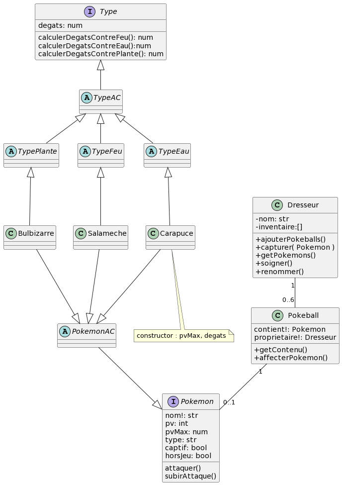

# TP POKEMON

## Consignes
Vous devez répondre aux questions puis développer le projet ci-après, en respecant le diagramme de classe fourni.
NB : Le diagramme ne fait état que de la logique métier. Il vous appartient d'y intégrer des fonctions (et/ou propriétés) supplémentaires si nécessaire, afin de permettre la réalisation des opérations demandées.

### Questions 

#### Répondez aux questions suivantes (sur 10 points) : NB : Il y a plus de points que nécessaire. Les points seront 'bonus'
##### 1. Le diagramme respecte-t-il le principe de responsabilité unique ? (1 point) 
	Je pense que non
##### 2. Pourquoi ? (1 point)
	Par exemple sur l'interface Pokemon on a la méthode soigner et renommer mais qui je pense devrais etre assigner a la class Dresseur avec un effet sur le Pokemon
##### 3. Le diagramme respecte-t-il le principe Open/Closed ? (1 point)
	Non
##### 4. Pourquoi ? (1 point)
	Alors je pense que non car des methodes ont besoin d'autre méthodes sur d'autres class pour fonctionner pour les attaques par exemple j'ai besoin du calcul de degats pour implementer la methode attaquer() sur les differents Pokemon
##### 5. Le diagramme respecte-t-il le principe de substitution de Liskov ? (1 point)
	Sur le principe non
##### 6. Pourquoi ? (1 point)
	Selon ce que j'ai compris , l'interface Type implemente
des methodes caracterisée sur des class abstraite type Feu Eau et Plante dnc rajouter un type (exemple : Fée ou Electrique) pourrait faire peter les autres types et faire un effet d'escalade en petant les classes pokemons
##### 7. Le diagramme respecte-t-il le principe de ségrégation des interfaces ? (1 point) 
	Non
##### 8. Pourquoi ? (1 point)
	La ségrégation des interfaces part sur le principe d'avoir plusieurs interfaces spécialisées avec un Single Responsability. Dans notre cas par exemple on a une interface Type avec 3 methode par rapport aux types deja existant. Il aurait fallu avoir une interface Type Feu pour implementer une classe Type feu et de meme avec les autres types pour respecter ce principe
##### 9. Le diagramme respecte-t-il le principe d'inversion des dépendences ? (1 point)
	Non
##### 10. Pourquoi ? (1 point)
	Il me semble que pour respecter le priuncipe d'inversion des dependances il aurait fallu dans notre cas avoir une class abstraite Pokemon hors ce n'est pas le cas. De ce fait on doit implementer les methodes pour chaque class Pokemon existant , si on decide de changer une methode il faudrait la changer chez tout les pokemons alors que si la methode avait été implementé dans la class abstraite generique Pokemon la maintenance aurait été plus facile
##### 11. Proposez un diagramme alternatif (2 point)

## Diagramme

##### 12. Déposez votre projet sur github et précisez le lien (1 point)
https://github.com/Mal0wn/TP_Pokemon

